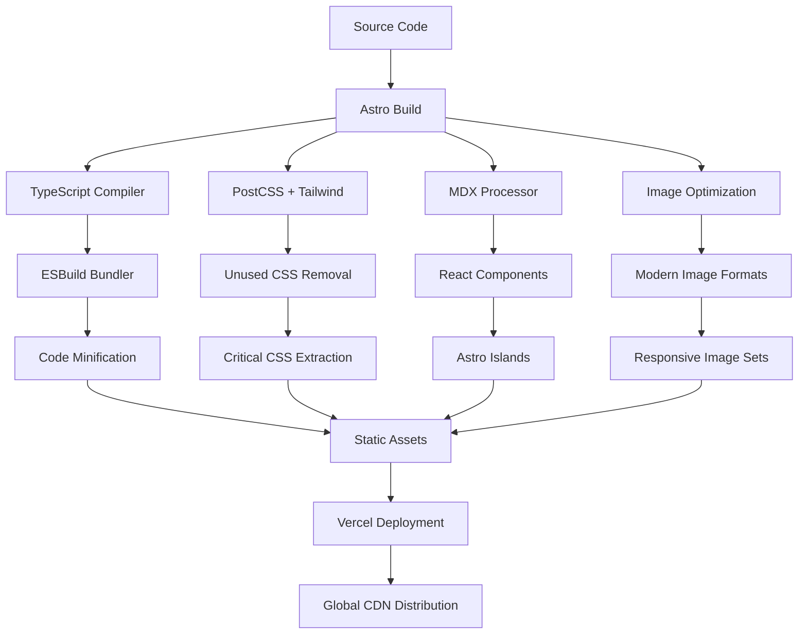
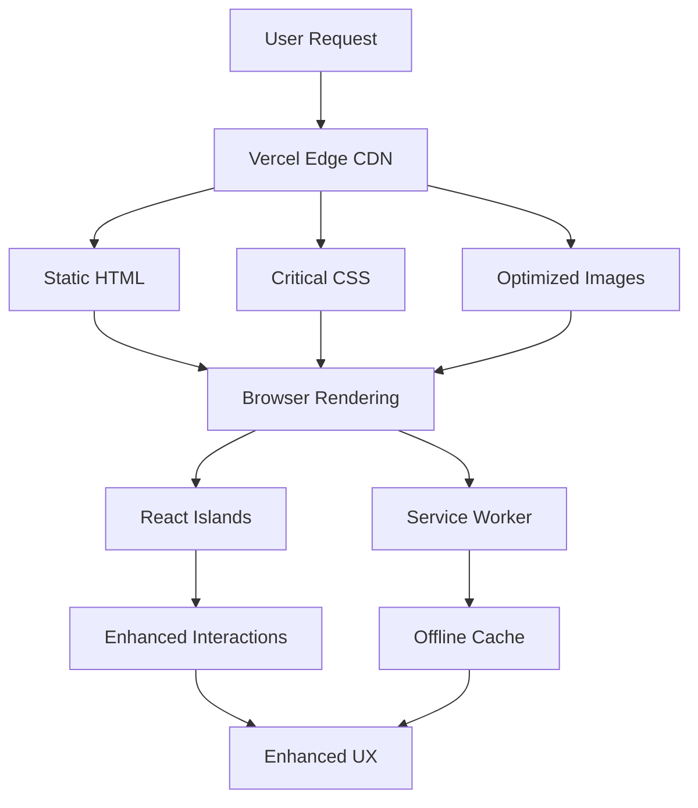

# Technology Stack: Dependency & Capability Graph

## Executive Summary

This document provides a comprehensive view of our technology stack's dependencies, capabilities, and decision-making framework. It shows how each technology serves VastSilicon's core philosophy and where they augment each other to create a system that embodies "complexity translation, not simplification."

## Philosophy-Technology Alignment Matrix

### Core Philosophy Principles → Technology Mapping

| Philosophy Principle | Primary Technology | Supporting Technologies | Capability Delivered |
|---------------------|-------------------|------------------------|---------------------|
| **Static-First (Pre-translate complexity)** | Astro | ESBuild, Sharp, PostCSS | Build-time optimization |
| **Progressive Enhancement** | React Islands | Service Workers, Modern CSS | Augmentation layers |
| **Performance as Trust** | Vercel Edge, Astro | Sharp, Bundle Analyzer | Sub-1s global delivery |
| **Accessibility as Right** | Semantic HTML, Tailwind | ARIA, Focus Management | Universal access |
| **Agency Restoration** | TypeScript, MDX | Component Architecture | User control preservation |

## Technology Capability Layers

### Layer 1: Foundation (Core Agency)
**Philosophy**: "Works for everyone, everywhere, always"

```
┌─────────────────────────────────────────────────┐
│                 FOUNDATION LAYER                │
├─────────────────────────────────────────────────┤
│ • Semantic HTML (structure + meaning)          │
│ • Critical CSS (visual hierarchy)              │
│ • Web Standards (universal compatibility)      │
│ • Static Generation (instant availability)     │
└─────────────────────────────────────────────────┘
```

**Technologies:**
- **HTML5**: Semantic structure, accessibility foundation
- **CSS3**: Layout, typography, responsive design
- **Astro**: Static generation, universal compatibility

**Capabilities Delivered:**
- Content readable without JavaScript
- Accessible to screen readers and assistive technologies
- Works on any device, any connection speed
- SEO-optimized by default

### Layer 2: Enhancement (Augmented Agency)
**Philosophy**: "Better with technology, essential without it"

```
┌─────────────────────────────────────────────────┐
│               ENHANCEMENT LAYER                 │
├─────────────────────────────────────────────────┤
│ • JavaScript Islands (targeted interactivity)  │
│ • Service Workers (offline capability)         │
│ • Modern CSS (advanced layouts)                │
│ • TypeScript (developer confidence)            │
└─────────────────────────────────────────────────┘
```

**Technologies:**
- **React**: Component-based interactivity
- **TypeScript**: Type safety and developer experience
- **Service Workers**: Offline-first capabilities
- **Modern CSS**: Grid, Container Queries, Custom Properties

**Capabilities Delivered:**
- Rich interactions where beneficial
- Offline functionality after first visit
- Type-safe development and refactoring
- Advanced responsive layouts

### Layer 3: Optimization (Invisible Excellence)
**Philosophy**: "Performance so good it's not noticed"

```
┌─────────────────────────────────────────────────┐
│              OPTIMIZATION LAYER                 │
├─────────────────────────────────────────────────┤
│ • Global CDN (edge delivery)                   │
│ • Asset optimization (every byte counts)       │
│ • Bundle analysis (performance budgets)        │
│ • Monitoring (continuous improvement)          │
└─────────────────────────────────────────────────┘
```

**Technologies:**
- **Vercel Edge**: Global content delivery
- **Sharp**: Image optimization and processing
- **ESBuild**: Fast bundling and minification
- **Lighthouse CI**: Performance monitoring

**Capabilities Delivered:**
- Sub-200ms TTFB globally
- Optimized assets (images, fonts, code)
- Performance budget enforcement
- Real user monitoring

## Dependency Graph

### Build-Time Dependencies



### Runtime Dependencies



## Technology Decision Matrix

### When to Use Each Technology

| Scenario | Technology Choice | Reasoning | Alternative Considered |
|----------|------------------|-----------|----------------------|
| **Static Content Page** | Astro + MDX | Pre-rendered, SEO optimized | Next.js SSG (heavier) |
| **Interactive Component** | React Island | Familiar to team, rich ecosystem | Svelte (smaller but less familiar) |
| **Styling System** | Tailwind CSS | Utility-first, performance optimized | Styled Components (runtime cost) |
| **Image Display** | Sharp + Picture Element | Automatic optimization, modern formats | Manual optimization (time cost) |
| **Form Handling** | React + Server Action | Progressive enhancement | Pure HTML (less UX) |
| **Data Fetching** | Build-time (Astro) | Static generation, no runtime cost | Client-side (slower) |
| **Animation** | CSS Animations | GPU accelerated, no JS cost | JS libraries (performance cost) |
| **Global State** | URL + Local Storage | Shareable, persistent | Context API (complexity) |

## Augmentation Strategy

### Progressive Enhancement Layers

#### Level 0: Base Experience (No JavaScript)
```
HTML + CSS = Full Content Access
├── Semantic structure readable by screen readers
├── Forms submit with page refresh
├── Navigation works via links
└── Content accessible and understandable
```

#### Level 1: Enhanced Experience (JavaScript Available)
```
Base + JavaScript Islands = Rich Interactions
├── Form validation and smooth submission
├── Interactive image carousels
├── Smooth scrolling and animations
└── Real-time feedback
```

#### Level 2: Optimal Experience (Modern Browser + Fast Connection)
```
Enhanced + Service Worker = App-like Experience
├── Offline functionality
├── Push notifications
├── Background sync
└── Install prompts
```

### Technology Intersection Points

#### Astro ↔ React Integration
```typescript
// Astro component with React island
---
// Astro frontmatter (server-side)
const products = await getProducts();
---

<Layout title="Products">
  <ProductGrid products={products} />
  <!-- React island for interactivity -->
  <ProductFilter client:load products={products} />
</Layout>
```

#### Tailwind ↔ React Component Styling
```tsx
// React component with Tailwind classes
export function ProductCard({ product }: ProductCardProps) {
  return (
    <div className="
      bg-white rounded-lg shadow-md overflow-hidden
      hover:shadow-lg transition-shadow duration-200
      focus-within:ring-2 focus-within:ring-blue-500
    ">
      {/* Component content */}
    </div>
  );
}
```

#### TypeScript ↔ Content Safety
```typescript
// Type-safe content and component props
interface ProductPageProps {
  product: {
    id: string;
    name: string;
    description: string;
    images: ResponsiveImage[];
    status: 'available' | 'coming-soon' | 'beta';
  };
}

// Compile-time validation of content structure
```

## Performance Impact Analysis

### Bundle Size Contributions

| Technology | Initial Bundle Impact | Runtime Impact | Optimization Strategy |
|------------|---------------------|----------------|---------------------|
| **Astro Core** | ~15KB | 0KB (static) | Tree shaking, minification |
| **React Runtime** | ~45KB | Variable per island | Code splitting, lazy loading |
| **Tailwind CSS** | ~10KB (purged) | 0KB | PurgeCSS, critical CSS |
| **TypeScript** | 0KB | 0KB (compile time) | Compile-time only |
| **Service Worker** | ~5KB | Minimal | Efficient caching strategies |
| **Total Target** | <100KB | <50KB per page | Aggressive optimization |

### Performance Waterfall

```
0-100ms:    DNS lookup, connection establishment
100-200ms:  HTML document delivered (Vercel Edge)
200-400ms:  Critical CSS applied, first paint
400-600ms:  Images loaded, layout stable
600-800ms:  JavaScript islands hydrated
800-1000ms: Service worker registered, offline ready
1000ms+:    Background optimizations, analytics
```

## Decision-Making Framework

### Technology Selection Criteria

#### Primary Filters (Must Pass All)
1. **Philosophy Alignment**: Does it serve complexity translation?
2. **Performance Impact**: Does it meet our <1s load time requirement?
3. **Accessibility**: Does it maintain universal access?
4. **Agency Preservation**: Does it enhance without gating?

#### Secondary Considerations (Weighted)
1. **Team Velocity** (25%): How quickly can team become productive?
2. **Ecosystem Health** (20%): Long-term viability and community support
3. **Maintenance Cost** (20%): Ongoing development and update burden
4. **Escape Routes** (15%): Can we migrate away if needed?
5. **Innovation Potential** (10%): Does it enable future capabilities?
6. **Cost Structure** (10%): Financial implications at scale

### Decision Templates

#### For Adding New Dependencies
```
Technology: _______________
Problem Solving: _______________
Philosophy Alignment: _______________
Performance Impact: _______________
Bundle Size: _______________
Alternative Solutions: _______________
Team Consensus: _______________
```

#### For Major Architecture Changes
```
Current State: _______________
Desired State: _______________
Migration Path: _______________
Risk Assessment: _______________
Rollback Plan: _______________
Success Metrics: _______________
```

## Usage Examples & Patterns

### Common Development Patterns

#### 1. Static Page with Progressive Enhancement
```astro
---
// products.astro - Static generation with React islands
export async function getStaticProps() {
  const products = await getProducts();
  return { props: { products } };
}
---

<Layout title="Products">
  <!-- Static content for SEO and base experience -->
  <ProductGrid products={products} />
  
  <!-- React island for filtering and search -->
  <ProductFilter 
    client:load 
    products={products}
    class="mt-8" 
  />
</Layout>
```

#### 2. Component with Tailwind Design System
```tsx
// Button component following VastSilicon design principles
export function Button({ 
  variant = 'primary', 
  size = 'medium',
  children,
  ...props 
}: ButtonProps) {
  const baseClasses = "font-medium rounded-lg transition-colors focus:outline-none focus:ring-2";
  const variants = {
    primary: "bg-blue-600 text-white hover:bg-blue-700 focus:ring-blue-500",
    secondary: "bg-gray-200 text-gray-900 hover:bg-gray-300 focus:ring-gray-500"
  };
  const sizes = {
    small: "px-3 py-1.5 text-sm",
    medium: "px-4 py-2 text-base",
    large: "px-6 py-3 text-lg"
  };
  
  return (
    <button 
      className={cn(baseClasses, variants[variant], sizes[size])}
      {...props}
    >
      {children}
    </button>
  );
}
```

#### 3. Service Worker for Offline Capability
```typescript
// sw.ts - Progressive enhancement for offline access
import { precacheAndRoute, cleanupOutdatedCaches } from 'workbox-precaching';
import { StaleWhileRevalidate } from 'workbox-strategies';
import { registerRoute } from 'workbox-routing';

// Precache static assets
precacheAndRoute(self.__WB_MANIFEST);
cleanupOutdatedCaches();

// Cache strategy for images
registerRoute(
  ({ request }) => request.destination === 'image',
  new StaleWhileRevalidate({
    cacheName: 'images',
    plugins: [{
      cacheKeyWillBeUsed: async ({ request }) => {
        return `${request.url}?version=1`;
      }
    }]
  })
);
```

## Monitoring & Optimization

### Key Metrics Dashboard

```typescript
// Performance monitoring configuration
const performanceMetrics = {
  // Core Web Vitals
  LCP: { target: '<1s', critical: '>2.5s' },
  FID: { target: '<100ms', critical: '>300ms' },
  CLS: { target: '<0.1', critical: '>0.25' },
  
  // VastSilicon specific
  timeToValue: { target: '<7s', critical: '>15s' },
  taskCompletion: { target: '>95%', critical: '<85%' },
  errorRate: { target: '<0.1%', critical: '>1%' },
  
  // Technical
  bundleSize: { target: '<500KB', critical: '>1MB' },
  buildTime: { target: '<2min', critical: '>5min' }
};
```

### Optimization Triggers

| Metric Breach | Action Required | Technology Involved |
|---------------|----------------|-------------------|
| Bundle size >500KB | Code splitting, tree shaking | ESBuild, Astro |
| LCP >1s | Image optimization, critical CSS | Sharp, PostCSS |
| JavaScript errors >0.1% | Type checking, testing | TypeScript, Testing |
| Build time >2min | Dependency audit, caching | All build tools |

## Future Evolution Path

### Planned Enhancements

#### Phase 2: Advanced Interactivity
- Web Components for reusable UI elements
- Advanced Service Worker capabilities
- Real-time features via WebSockets

#### Phase 3: AI Integration
- Edge computing for AI inference
- Personalization at CDN level
- Dynamic content optimization

#### Phase 4: Platform Expansion
- Micro-frontend architecture
- Shared component library
- Cross-domain functionality

### Technology Migration Strategy

```
Current: Astro + React Islands
├── Maintain: Core architecture and philosophy
├── Evolve: Add capabilities without breaking changes
├── Replace: Only when clear benefit and migration path
└── Expand: Additional technologies for new capabilities
```

## Conclusion

This technology stack creates a dependency graph that mirrors VastSilicon's philosophy: complexity handled elegantly behind the scenes, simplicity presented to users, agency preserved throughout. Each technology serves a specific purpose in the cognitive augmentation pipeline, from build-time optimization to runtime enhancement.

The system is designed to be both resilient and evolutionary—core capabilities work universally, while enhanced features provide augmentation when available. This ensures we practice what we preach: making complexity serve humans, not overwhelm them.

---

**Last Updated**: 2025-01-06  
**Next Review**: 2025-04-06  
**Maintained By**: Development Team