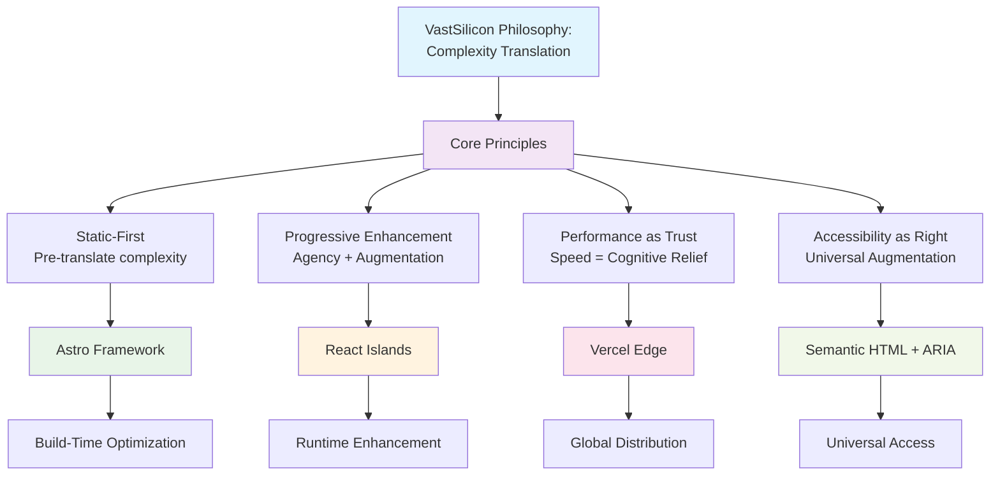
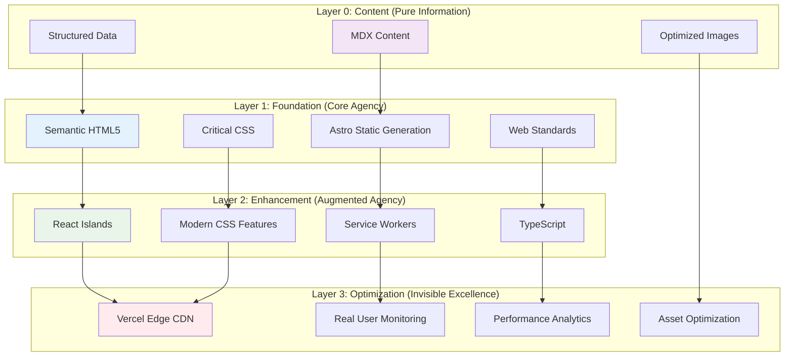
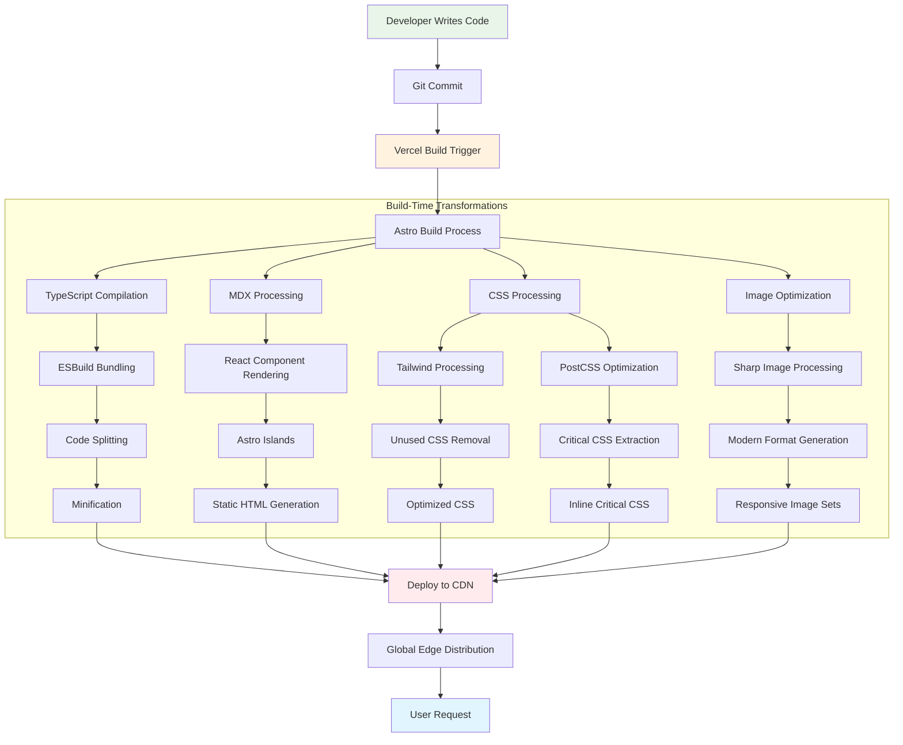
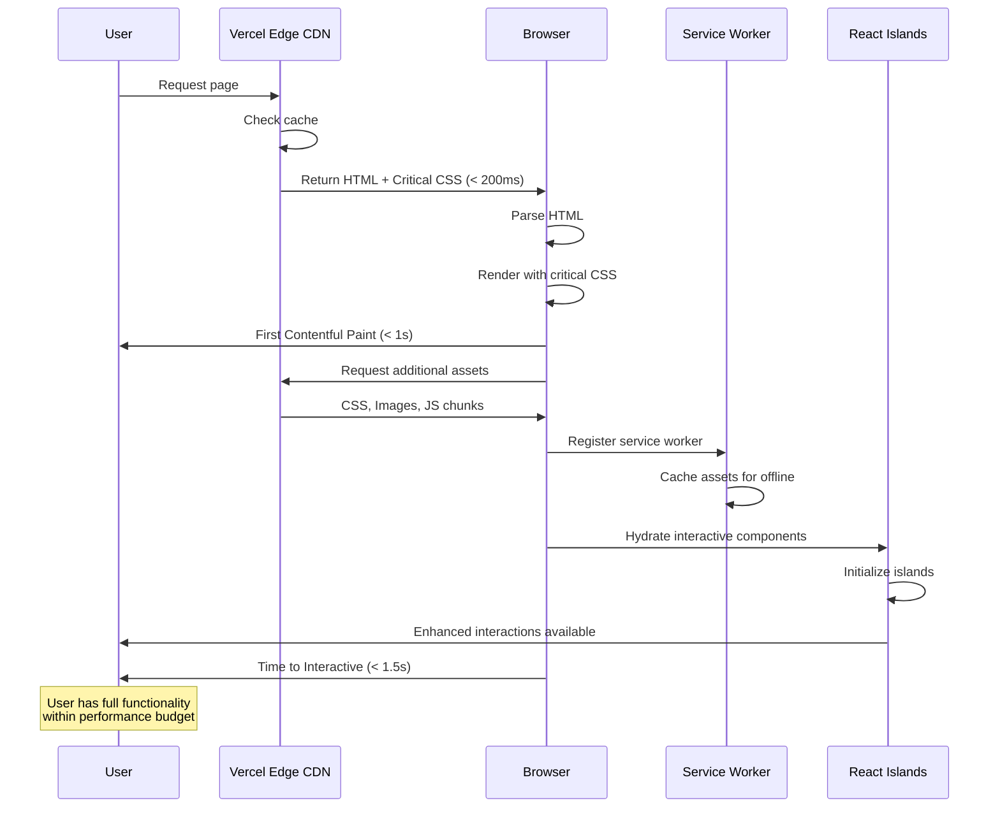
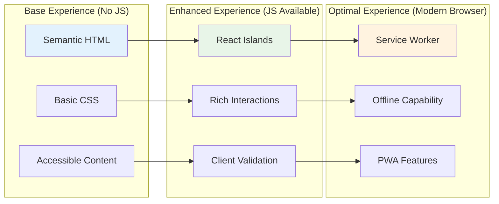
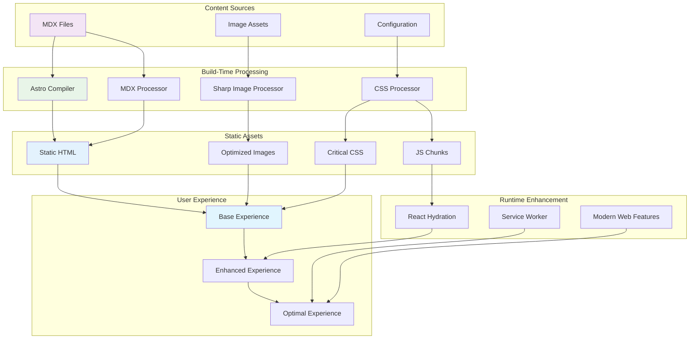
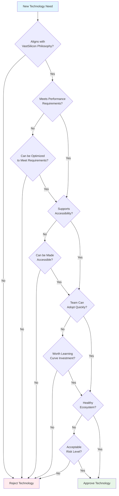
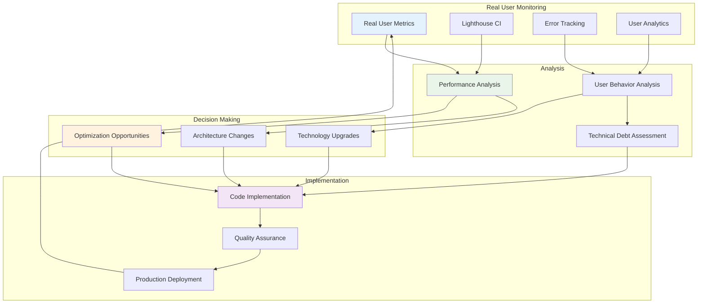

# Visual Architecture Diagrams

## System Architecture Overview

### High-Level Philosophy → Technology Mapping



## Technology Stack Layers

### Layer Architecture with Dependencies



## Build Process Flow

### Development to Production Pipeline



## Runtime Architecture

### User Request to Response Flow



## Component Architecture

### Progressive Enhancement Pattern



## Data Flow Architecture

### Content to User Journey



## Performance Waterfall Visualization

### Load Time Breakdown

```mermaid
gantt
    title Performance Waterfall (Target: <1s Total)
    dateFormat X
    axisFormat %Lms
    
    section DNS & Connection
    DNS Lookup           :0, 50
    TCP Connection       :50, 100
    
    section Document
    Request              :100, 120
    Server Response      :120, 200
    HTML Download        :200, 250
    
    section Critical Path
    Parse HTML           :250, 300
    Critical CSS Apply   :300, 400
    First Paint          :400, 450
    
    section Assets
    Image Load           :300, 600
    Font Load            :350, 500
    JS Download          :400, 550
    
    section Enhancement
    JS Parse             :550, 650
    React Hydration      :650, 800
    Service Worker       :700, 900
    
    section Complete
    Time to Interactive  :800, 1000
```



## Technology Decision Tree

### Selection Framework Visual



## Monitoring & Feedback Loops

### Continuous Improvement Cycle



## Capability Matrix

### Technology × Capability Intersection

```mermaid
graph TD
    subgraph "Capabilities"
        StaticGen[Static Generation]
        Interactive[Interactivity]
        Performance[Performance]
        Offline[Offline Support]
        Accessibility[Accessibility]
        TypeSafety[Type Safety]
        DevExp[Developer Experience]
        GlobalDist[Global Distribution]
    end
    
    subgraph "Technologies"
        Astro[Astro]
        React[React]
        TypeScript[TypeScript]
        Tailwind[Tailwind]
        Vercel[Vercel]
        ServiceWorker[Service Worker]
        Sharp[Sharp]
        ESBuild[ESBuild]
    end
    
    Astro -.->|Primary| StaticGen
    Astro -.->|Secondary| Performance
    Astro -.->|Secondary| DevExp
    
    React -.->|Primary| Interactive
    React -.->|Secondary| DevExp
    
    TypeScript -.->|Primary| TypeSafety
    TypeScript -.->|Primary| DevExp
    
    Tailwind -.->|Primary| Performance
    Tailwind -.->|Primary| DevExp
    Tailwind -.->|Secondary| Accessibility
    
    Vercel -.->|Primary| GlobalDist
    Vercel -.->|Primary| Performance
    
    ServiceWorker -.->|Primary| Offline
    ServiceWorker -.->|Secondary| Performance
    
    Sharp -.->|Primary| Performance
    
    ESBuild -.->|Primary| Performance
    ESBuild -.->|Secondary| DevExp
    
    style StaticGen fill:#e8f5e8
    style Interactive fill:#fff3e0
    style Performance fill:#ffebee
    style Offline fill:#f3e5f5
```



## Migration Strategy Visual

### Evolution Path

```mermaid
timeline
    title Technology Evolution Timeline
    
    section Phase 1: Foundation
        Current Stack Setup    : Astro + React + TypeScript
                              : Tailwind CSS + Vercel
                              : Basic performance optimization
    
    section Phase 2: Enhancement
        Advanced Features      : Service Workers
                              : Advanced React patterns
                              : Performance monitoring
    
    section Phase 3: Optimization
        Performance Tuning     : Edge computing features
                              : Advanced caching strategies
                              : Real-time optimizations
    
    section Phase 4: Platform
        Ecosystem Expansion    : Micro-frontends
                              : Shared component library
                              : Cross-domain features
```

---

This visual documentation complements the comprehensive dependency and capability analysis, providing clear visual representations of how our technology stack serves VastSilicon's philosophy of complexity translation and agency restoration.