# Analytics Architecture

## System Overview

VastSilicon's analytics implementation prioritizes performance through minimal bundle impact while providing comprehensive tracking of user behavior and website performance metrics.

```mermaid
graph TB
    subgraph "Client Browser"
        A[Next.js App] --> B[Analytics Component]
        A --> C[Performance Monitor]
        A --> D[Business Components]
        
        B --> E[@vercel/analytics React]
        C --> F[Web Vitals Library]
        D --> G[Analytics Events API]
    end
    
    subgraph "Event Processing"
        E --> H[Vercel Analytics SDK]
        F --> H
        G --> H
        
        H --> I[Event Validation]
        I --> J[Data Enrichment]
        J --> K[Transmission Queue]
    end
    
    subgraph "Vercel Infrastructure"
        K --> L[Analytics Ingestion]
        L --> M[Data Processing]
        M --> N[Real-time Dashboard]
        M --> O[Historical Storage]
    end
    
    subgraph "Access Points"
        N --> P[Vercel Dashboard]
        O --> Q[Analytics API]
        Q --> R[Data Export]
    end
    
    style A fill:#e1f5fe
    style H fill:#f3e5f5
    style L fill:#e8f5e8
    style P fill:#fff3e0
```

## Component Architecture

### Core Components


## Data Flow Architecture

### Event Lifecycle


## Event Schema Architecture

### Event Classification

```mermaid
flowchart TD
    A["🎯 All Events"] --> B["🤖 Automatic Events"]
    A --> C["✋ Custom Events"]
    
    B --> D[pageview]
    B --> E["navigation events"]
    
    C --> F["💼 Business Events"]
    C --> G["⚡ Performance Events"]
    
    F --> H[app_store_click]
    F --> I[content_engagement]
    
    G --> J["Core Web Vital"]
    G --> K["Long Task"]
    G --> L["Slow Resource"]
    
    subgraph Props["📋 Event Properties"]
        direction TB
        H --> M["product: string"]
        H --> N["platform: ios|android"]
        
        J --> O["metric: LCP|CLS|INP|FCP|TTFB"]
        J --> P["value: number"]
        J --> Q["rating: good|needs-improvement|poor"]
    end
    
    classDef auto fill:#e8f5e8,stroke:#4caf50
    classDef custom fill:#e1f5fe,stroke:#2196f3
    classDef business fill:#fff3e0,stroke:#ff9800
    classDef performance fill:#fce4ec,stroke:#e91e63
    
    class B auto
    class C custom
    class F business
    class G performance
```



## Technical Integration

### Bundle Impact Analysis


## Implementation Patterns

### Event Tracking Pattern


## Configuration Management

### Environment-Based Behavior


## Monitoring and Maintenance

### Health Monitoring


## Security and Privacy

### Data Protection Architecture


## Usage Guidelines

### Development Workflow


## Future Considerations

### Scalability Architecture


This architecture ensures performance-first analytics implementation while maintaining flexibility for future growth and changes.